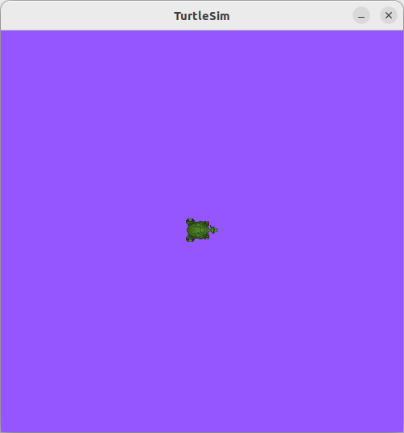

# 参数与参数服务器
:label:`sec_parameter`

在ROS 2中，参数（Parameter）是节点用来存储配置信息的键值对。节点可以使用参数来保存配置数据，这些数据可以是静态的，也可以是动态变化的。参数可以被节点内部使用，也可以被其他节点查询。参数的使用提供了一种灵活的方式来配置和调整节点的行为，而无需修改节点的代码。

参数服务器（Parameter Server）是一个用于存储和检索参数的分布式系统。参数服务器允许节点在运行时动态地共享和访问配置信息，如硬件设置、算法参数、系统配置等。与ROS 1中的集中式参数服务器不同，ROS 2的参数服务器是分布式系统的一个组成部分，这意味着参数的存储和检索是在节点本地进行的，但参数的更改会通过DDS传播到所有订阅了相应参数的节点。

节点可以设置（set）、获取（get）和删除（delete）参数。参数操作通常用于节点启动时加载配置，或者在运行时根据某些条件动态调整配置。节点可以注册参数事件监听器，以便在参数更改时收到通知。参数事件监听器允许节点响应参数的动态变化，例如更新内部状态或重新配置系统。参数的更改会通过DDS传播到所有订阅了相应参数的节点。

参数服务器支持层级结构的参数名，这允许在逻辑上组织参数，例如将相关的参数分组到共同的命名空间下。参数可以具有不同的生命周期，例如有些参数可能在节点启动时设置一次，而其他参数可能会频繁更改。参数服务器支持不同的QoS设置，以控制参数通信的可靠性、持久性和实时性。每个节点会在其本地存储参数的副本，这样可以减少对网络的依赖，并提高访问速度。

参数服务器为机器人系统提供了一种强大的配置和管理工具。它允许开发者轻松地部署和维护复杂的机器人系统，同时确保了系统配置的灵活性和一致性。通过这种方式，开发者可以更专注于实现机器人的功能和行为，而不是处理配置和管理的问题。

## 使用命令行工具操作参数

ROS 2中的参数属于各个节点。它们用于在节点启动时以及运行期间进行配置，无需更改代码。参数的生命周期依赖于节点的生命周期（尽管节点可以实现某种形式的持久化，以便在重启后重新加载值）。

参数通过节点名称、节点命名空间、参数名称和参数命名空间来寻址。提供参数命名空间是可选的。

每个参数由一个键、一个值和一个描述符组成。键是一个字符串，而值可以是布尔值、64位整数、64位浮点数、字符串、字节数组、布尔数组、64位整数数组、64位浮点数数组或字符串数组中的一种。一般来说，所有描述符都是空的，但它们可以包含参数描述、值范围、类型信息以及附加约束。

打开一个新终端并运行：

```bash
ros2 run turtlesim turtlesim_node
```

打开另一个终端并运行：

```bash
ros2 run turtlesim turtle_teleop_key
```

此时，两个节点``/turtlesim``和``/teolep_turtle``被启动。

要查看属于各节点的参数，需要打开一个新终端并输入命令：

```bash
ros2 param list
```

此时可以看到节点名称空间/teleop_turtle和/turtlesim，后面是每个节点的参数：

```
/teleop_turtle:
  qos_overrides./parameter_events.publisher.depth
  qos_overrides./parameter_events.publisher.durability
  qos_overrides./parameter_events.publisher.history
  qos_overrides./parameter_events.publisher.reliability
  scale_angular
  scale_linear
  use_sim_time
/turtlesim:
  background_b
  background_g
  background_r
  qos_overrides./parameter_events.publisher.depth
  qos_overrides./parameter_events.publisher.durability
  qos_overrides./parameter_events.publisher.history
  qos_overrides./parameter_events.publisher.reliability
  use_sim_time
```

每个节点都有参数use_sim_time，这不是turtlesim独有的，它用于控制节点是否应该使用仿真时间。当这个参数被设置为true时，节点会使用仿真时间。在仿真环境中，这个参数非常有用，因为它允许用户控制节点的时钟速度，从而模拟不同的物理现象。在实际应用中，use_sim_time通常被设置为false，因为大多数应用程序都使用实际时间。

从名称可以猜测出，``/turtlesim``通过参数使用RGB颜色值来确定turtlesim窗口的背景颜色。

可以命令``ros2 param get <node_name> <parameter_name>``查看具体参数的类型和当前值，例如要查看background_g参数：

```bash
ros2 param get /turtlesim background_g
```

以上命令将返回如下信息：

```
Integer value is: 86
```

由此可知，background_g包含一个值为86的整数。利用相同的方法，可以得到background_r和background_b的值分别为69和255。

在运行时修改参数的值，可以使用命令``ros2 param set <node_name> <parameter_name> <value>``，这里尝试修改一下``/turtlesim``的背景颜色：

```bash
ros2 param set /turtlesim background_r 150
```

终端将返回执行结果：

```
Set parameter successful
```

此时turtlesim窗口的背景应该会改变颜色，如 :numref:`fig_turtlesim_background` 所示：


:label:`fig_turtlesim_background`

使用set命令设置参数只会在当前会话中被修改，而不会永久修改。但是，可以保存设置并在下次启动节点时重新加载它们。

可以使用命令``ros2 param dump <node_name>``查看节点的所有当前参数值。默认情况下，该命令将结果打印到标准输出（stdout），但是也可以将输出重定向到一个文件中，保存结果以备将来使用。要将``/turtlesim``参数的当前配置保存到文件turtlesim.yaml中，需要运行命令：

```bash
ros2 param dump /turtlesim > turtlesim.yaml
```

在当前终端可以找到这个文件。打开该文件，可以看到以下内容：

```
/turtlesim:
  ros__parameters:
    background_b: 255
    background_g: 86
    background_r: 150
    qos_overrides:
      /parameter_events:
        publisher:
          depth: 1000
          durability: volatile
          history: keep_last
          reliability: reliable
    use_sim_time: false
```

如果想要在将来使用相同的参数重新加载节点，则转存参数非常有用。

可以使用命令``ros2 param load <node_name> <parameter_file>``将参数从文件加载到当前运行的节点。例如，要将之前生成的turtlesim.yaml文件加载到``/turtlesim``节点的参数中，需要运行命令：

```bash
ros2 param load /turtlesim turtlesim.yaml
```

终端将返回如下消息：

```
Set parameter background_b successful
Set parameter background_g successful
Set parameter background_r successful
Set parameter qos_overrides./parameter_events.publisher.depth failed: parameter 'qos_overrides./parameter_events.publisher.depth' cannot be set because it is read-only
Set parameter qos_overrides./parameter_events.publisher.durability failed: parameter 'qos_overrides./parameter_events.publisher.durability' cannot be set because it is read-only
Set parameter qos_overrides./parameter_events.publisher.history failed: parameter 'qos_overrides./parameter_events.publisher.history' cannot be set because it is read-only
Set parameter qos_overrides./parameter_events.publisher.reliability failed: parameter 'qos_overrides./parameter_events.publisher.reliability' cannot be set because it is read-only
Set parameter use_sim_time successful
```

只读参数只能在启动时修改，而不能在启动后修改，这就是为什么“qos_overrides”参数会出现一些警告的原因。

要使用保存的参数值启动同一节点，需要使用命令``ros2 run <package_name> <executable_name> --ros-args --params-file <file_name>``，与通常用于启动turtlesim的命令相比，增加了``--ros args``和``--params-file``，以及要加载的文件。关闭正在运行的turtlesim节点，并尝试使用保存的参数重新加载它，运行：

```bash
ros2 run turtlesim turtlesim_node --ros-args --params-file turtlesim.yaml
```

当在节点启动时使用参数文件时，包括只读参数在内的所有参数都将更新。turtlesim窗口应该像往常一样出现，但背景变成了之前设置的紫色。

## 编程实现参数操作

本小节将实现一个简单的节点，该节点可以通过参数进行配置，并可以通过修改参数值改变其行为。

**使用Python实现**

导航到``~/ros2_ws/src``，利用之前创建的包``pkg_py_example``来实现相关功能。

在pkg_py_example子目录中创建一个名为simple_parameter.py的新文件，并添加如下内容：

```python
import rclpy  # 导入rclpy模块，这是ROS2的Python客户端库
from rclpy.node import Node  # 从rclpy.node模块中导入Node类，用于创建节点
from rcl_interfaces.msg import SetParametersResult  # 从rcl_interfaces消息中导入SetParametersResult消息类型
from rclpy.parameter import Parameter  # 从rclpy.parameter模块中导入Parameter类

# 定义一个名为SimpleParameter的类，继承自Node类
class SimpleParameter(Node):
    
    def __init__(self):
        super().__init__("simple_parameter")  # 调用父类的构造函数，创建节点，节点名称为simple_parameter
        self.declare_parameter("simple_int_param", 28)  # 声明一个整数类型的参数，默认值为28
        self.declare_parameter("simple_string_param", "Robot")  # 声明一个字符串类型的参数，默认值为"Robot"

        # 添加一个设置参数的回调函数，当参数发生变化时调用
        self.add_on_set_parameters_callback(self.paramChangeCallback)

    # 定义参数变化的回调函数
    def paramChangeCallback(self, params):
        result = SetParametersResult()  # 创建一个SetParametersResult对象

        # 遍历所有传递进来的参数
        for param in params:
            # 如果参数名称为simple_int_param并且类型为整数
            if param.name == "simple_int_param" and param.type_ == Parameter.Type.INTEGER:
                self.get_logger().info("Param simple_int_param changed! New value is %d" % param.value)  # 打印新值
                result.successful = True  # 设置结果成功

            # 如果参数名称为simple_string_param并且类型为字符串
            if param.name == "simple_string_param" and param.type_ == Parameter.Type.STRING:
                self.get_logger().info("Param simple_string_param changed! New value is %s" % param.value)  # 打印新值
                result.successful = True  # 设置结果成功

        # 返回结果对象
        return result

# 定义主函数
def main():
    rclpy.init()  # 初始化rclpy
    simple_parameter = SimpleParameter()  # 创建SimpleParameter对象
    rclpy.spin(simple_parameter)  # 保持节点运行，等待设置参数
    simple_parameter.destroy_node()  # 销毁节点
    rclpy.shutdown()  # 关闭rclpy

# 判断是否为主程序
if __name__ == "__main__":
    main()  # 如果是主程序，则运行主函数
```

ROS 2节点可以设置两种不同类型的回调，以便在参数发生变更时得到通知。这两种回调都是可选的。

第一种是“set parameter”类型的回调，可以通过调用节点API中的``add_on_set_parameters_callback``来设置。该回调接收一个不可变的``Parameter``对象数组，并返回一个``rcl_interfaces/msg/SetParametersResult``。这个回调的主要目的是让用户能够审查即将发生的参数更改，并在必要时明确拒绝这些更改。以上程序使用的是这种回调。

第二种类型的回调是“on parameter event”类型的回调，可以通过调用节点API中的``on_parameter_event``来设置。该回调接收一个``rcl_interfaces/msg/ParameterEvent``对象，但不返回任何结果。此回调将在输入事件中的所有参数声明、更改或删除操作完成后被调用。这个回调的主要目的是让用户能够响应那些已成功更新的参数。

由于在代码中添加了一个来自rcl_interfaces库的新依赖，需要在package.xml文件中添加``<depend>rcl_interfaces</depend>``来声明这个新依赖。

为了正确构建代码，还需要在setup.py文件中的entry_points部分添加新的可执行文件声明``'simple_parameter = pkg_py_example.simple_parameter:main',``，声明一个名为simple_parameter的可执行文件。

现在可以构建工作空间了。当成功构建工作空间，并source当前工作空间后，运行``ros2 run pkg_py_example simple_parameter``启动带有自定义参数的节点。

打开一个新的终端，运行：

```bash
ros2 param list
```

该命令返回如下信息：

```
/simple_parameter:
  simple_int_param
  simple_string_param
  use_sim_time
```

可以看到自定义的两个参数在节点的参数列表中。

查询一下simple_int_param的值：

```bash
ros2 param get /simple_parameter simple_int_param
```

该命令返回如下信息：

```
Integer value is: 28
```

该值为在程序中设置的默认值。

如果关闭该节点，并在重新打开时设置一个新的初始值：

```bash
ros2 run pkg_py_example simple_parameter --ros-args -p simple_int_param:=30
```

再次查询simple_int_param的值时，将会得到：``Integer value is: 30``。

还可以在节点执行过程中更改参数的值。运行：

```bash
ros2 param set /simple_parameter simple_string_param "Hello Ros 2"
```

在当前终端会返回：

```
Set parameter successful
```

在节点运行的终端会返回：

```
[INFO] [1711609680.581369073] [simple_parameter]: Param simple_string_param changed! New value is Hello Ros 2
```

查询一下simple_string_param的值：

```bash
ros2 param get /simple_parameter simple_string_param
```

终端会返回如下信息：

```
String value is: Hello Ros 2
```

**使用C++实现**

导航到``~/ros2_ws/src``，利用之前创建的包``pkg_cpp_example``来实现相关功能。

在src目录中新建文件simple_parameter.cpp，并添加以下内容：

```cpp
#include <rclcpp/rclcpp.hpp>                            // 导入rclcpp头文件，这是ROS2的C++客户端库
#include <rcl_interfaces/msg/set_parameters_result.hpp> // 导入rcl_interfaces消息中set_parameters_result消息类型

#include <vector> // 导入vector头文件，用于存储参数列表
#include <string> // 导入string头文件，用于字符串操作
#include <memory> // 导入memory头文件，用于智能指针

using std::placeholders::_1; // 使用placeholders命名空间中的_1占位符，用于回调函数

// 定义一个名为SimpleParameter的类，继承自rclcpp::Node
class SimpleParameter : public rclcpp::Node
{
public:
    // 构造函数
    SimpleParameter() : Node("simple_parameter")
    {
        declare_parameter<int>("simple_int_param", 28);                   // 声明一个整数类型的参数，默认值为28
        declare_parameter<std::string>("simple_string_param", "Antonio"); // 声明一个字符串类型的参数，默认值为"Antonio"
        // 添加一个设置参数的回调函数，当参数发生变化时调用
        param_callback_handle_ = add_on_set_parameters_callback(std::bind(&SimpleParameter::paramChangeCallback, this, _1));
    }

private:
    // 声明一个设置参数回调处理的共享指针
    OnSetParametersCallbackHandle::SharedPtr param_callback_handle_;

    // 定义设置参数变化的回调函数
    rcl_interfaces::msg::SetParametersResult paramChangeCallback(const std::vector<rclcpp::Parameter> &parameters)
    {
        // 声明结果消息变量
        rcl_interfaces::msg::SetParametersResult result;
        for (const auto &param : parameters)  // 遍历传递进来的参数列表，检查每个参数的名称和类型
        {
            // 如果找到名为"simple_int_param"且类型为整数的参数
            if (param.get_name() == "simple_int_param" && param.get_type() == rclcpp::ParameterType::PARAMETER_INTEGER)
            {
                RCLCPP_INFO_STREAM(get_logger(), "Param simple_int_param changed! New value is " << param.as_int()); // 打印出新的整数值
                result.successful = true; // 设置结果对象，表示参数设置成功
            }
            // 如果找到名为"simple_string_param"且类型为字符串的参数
            if (param.get_name() == "simple_string_param" && param.get_type() == rclcpp::ParameterType::PARAMETER_STRING)
            {
                RCLCPP_INFO_STREAM(get_logger(), "Param simple_string_param changed! New value is " << param.as_string()); // 打印出新的字符串值
                result.successful = true; // 设置结果对象，表示参数设置成功
            }
        }

        return result;     // 返回结果
    }
};

// 定义主函数
int main(int argc, char *argv[])
{
    rclcpp::init(argc, argv);                        // 初始化rclcpp
    auto node = std::make_shared<SimpleParameter>(); // 创建SimpleParameter对象
    rclcpp::spin(node);                              // 保持节点运行，等待设置参数
    rclcpp::shutdown();                              // 关闭rclcpp
    return 0;                                        // 程序正常退出
}
```

由于在代码中添加了一个来自rcl_interfaces库的新依赖，需要在package.xml文件中添加``<depend>rcl_interfaces</depend>``来声明这个新依赖。

为了正确编译脚本，还需要修改CMakeLists.txt文件，并在其中添加如下内容：

```cmake
find_package(rcl_interfaces REQUIRED)

add_executable(simple_parameter src/simple_parameter.cpp)
ament_target_dependencies(simple_parameter rclcpp rcl_interfaces)
```

告诉编译器引入rcl_interfaces库，并编译目标为名为simple_parameter的可执行文件，使用源文件src/simple_parameter.cpp，且编译时需要链接rclcpp和rcl_interfaces这两个依赖库。

最后，还需要在其install配置中添加``simple_parameter``，以便其能够被安装到正确的位置。

现在可以构建工作空间了。现在可以构建工作空间了。当成功构建工作空间，并source当前工作空间后，运行``ros2 run pkg_cpp_example simple_parameter``启动带有自定义参数的节点。对C++节点参数的操作与上面对Python节点参数操作的方式一样。

注意，当运行``ros2 param list``时，C++节点会显示额外的4个与QoS有关的参数：

```
/simple_parameter:
  qos_overrides./parameter_events.publisher.depth
  qos_overrides./parameter_events.publisher.durability
  qos_overrides./parameter_events.publisher.history
  qos_overrides./parameter_events.publisher.reliability
  simple_int_param
  simple_string_param
  use_sim_time
```

QoS参数是用于控制节点间通信的性能和可靠性的一组设置。这些参数定义了如何处理发布和订阅的消息，以及如何管理队列和缓冲区。QoS参数允许用户根据不同的通信需求来定制节点的行为。这里先忽略。
