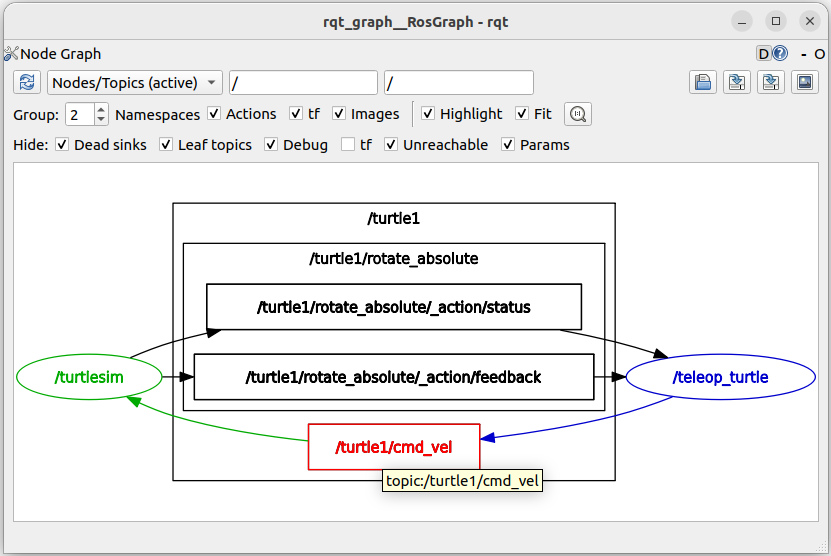
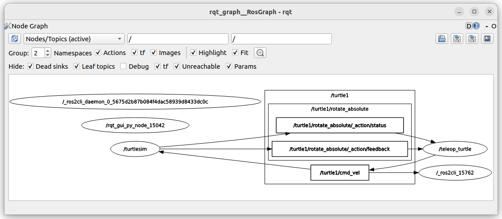
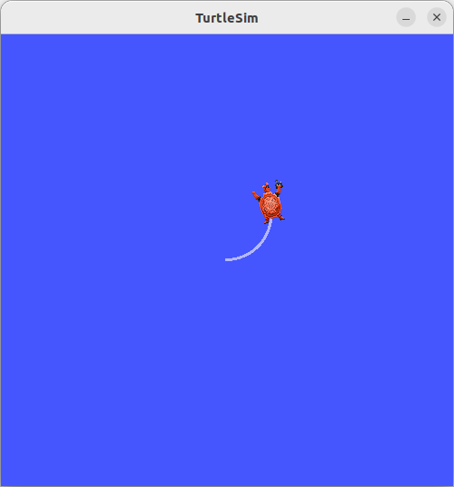
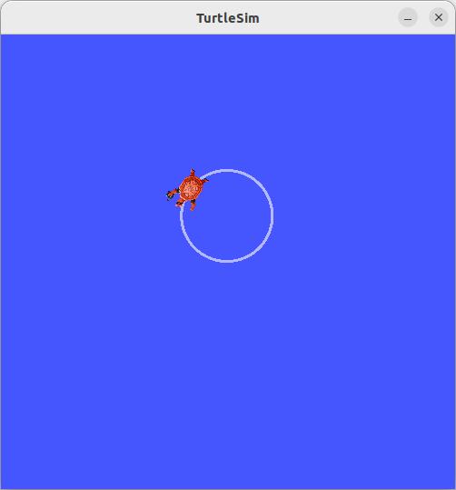
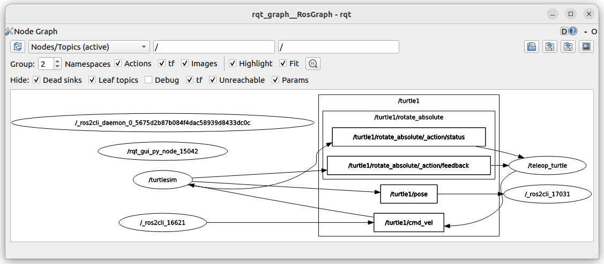

# 话题详述
:label:`sec_topic`

话题（topic）是一种基于发布/订阅（publish/subscribe）模式的通信机制。这种机制允许不同的节点之间异步地交换数据，而无需知道彼此的存在。

发布者（Publisher）是一个节点，它定期（或根据事件）向一个特定的话题发布特定类型的消息（Message）数据。发布者不需要知道是否有订阅者接收数据，也不需要知道订阅者的数量。

订阅者（Subscriber）是一个节点，它订阅一个特定的话题以接收数据。当发布者向话题发布消息时，所有订阅了这个话题的订阅者都会接收到这些消息。订阅者不需要知道发布者的身份，也不需要知道是否有其他订阅者存在。

话题（Topic）是一个命名的通道，用于在发布者和订阅者之间传递消息。话题的消息类型必须由发布者和所有订阅者共同定义，以确保数据的兼容性。话题是ROS图中的一个关键组件，它们通过名称进行标识，通常使用反向域名风格的命名约定。

消息（Message）是发布者和订阅者之间传递的数据。每个话题都有一个与之关联的消息类型，定义了数据的结构。消息可以是简单的数据类型，如整数、浮点数、字符串，也可以是复杂的数据结构，包含多个字段和其他消息类型。

ROS 2使用DDS作为其底层通信机制，话题通信也是建立在DDS之上的。发布者和订阅者在启动时会向ROS 2的发现服务器注册自己，包括它们要发布或订阅的话题。发现服务器负责管理话题的名称和节点的注册信息，帮助发布者和订阅者建立连接。一旦发布者和订阅者之间建立了连接，它们就可以直接通信，不再需要发现服务器的介入。

综上，话题通信机制是ROS 2中最常用的数据传输方式，它提供了一种灵活、松耦合的机制，使得不同的节点可以轻松地交换数据，而无需关心彼此的实现细节。

## 使用命令行工具操作话题

打开一个新终端并运行：

```bash
ros2 run turtlesim turtlesim_node
```

打开另一个终端并运行：

```bash
ros2 run turtlesim turtle_teleop_key
```

默认情况下，这两个节点的名称为``/turtlesim``和``/teolep_turtle``。

为了可视化不断变化的节点和话题，以及它们之间的连接，请打开一个新终端并输入命令：

```bash
rqt_graph
```

如果将鼠标悬停在中心的话题上，则可以看到图像中的颜色高亮显示，如 :numref:`fig_rqt_topic_graph` 所示：


:label:`fig_rqt_topic_graph`

该图描述了``/turtlesim``节点和``/teleop_turtle``节点如何在一个话题上相互通信。``/teleop_turtle``节点正在向``/turtle1/cmd_vel``话题发布数据（用于移动乌龟的按键输入），``/turtlesim``节点订阅该话题以接收数据。rqt_graph的高亮显示功能在检查以多种不同方式连接的许多节点和话题的更复杂系统时非常有用。

在新终端中运行``ros2 topic list``命令将返回系统中当前活动的所有话题的列表：

```
/parameter_events
/rosout
/turtle1/cmd_vel
/turtle1/color_sensor
/turtle1/pose
```

命令``ros2 topic list -t``将返回相同的话题列表，只不过话题消息类型将附加在方括号中：

```
/parameter_events [rcl_interfaces/msg/ParameterEvent]
/rosout [rcl_interfaces/msg/Log]
/turtle1/cmd_vel [geometry_msgs/msg/Twist]
/turtle1/color_sensor [turtlesim/msg/Color]
/turtle1/pose [turtlesim/msg/Pose]
```

要查看关于某个话题的发布数据，可以使用``ros2 topic echo <topic_name>``。由于我们知道``/teleop_turtle``通过``/turtle1/cmd_vel``话题向``/turtlesim``发布数据，这里运行：

```bash
ros2 topic echo /turtle1/cmd_vel
```

起初，此命令不会返回任何数据。这是因为它正在等待/teleop_turtle发布一些内容。

返回turtle_teleop_key正在运行的终端，使用箭头移动乌龟。观察同时在运行echo的终端，可以看到每次移动的位置数据都在发布：

```
......
---
linear:
  x: 0.0
  y: 0.0
  z: 0.0
angular:
  x: 0.0
  y: 0.0
  z: -2.0
---
linear:
  x: 2.0
  y: 0.0
  z: 0.0
angular:
  x: 0.0
  y: 0.0
  z: 0.0
---
......
```

现在返回rqt_graph并取消选中Debug复选框，可以看到发布者正在cmd_vel话题上发布数据，并且有两个订阅者订阅了该话题。/_ros2cli_15762是刚刚运行的echo命令创建的节点（编号可能不同），如 :numref:`fig_rqt_topic_graph2` 所示。


:label:`fig_rqt_topic_graph2`

另一种了解这一点的方式是``ros2 topic info``命令：

```bash
ros2 topic info /turtle1/cmd_vel
```

该命令返回：

```
Type: geometry_msgs/msg/Twist
Publisher count: 1
Subscription count: 2
```

节点使用消息通过话题发送数据。发布者和订阅者必须发送和接收相同类型的消息才能进行通信。``cmd_vel``话题的类型为：``geometry_msgs/msg/Twist``，这意味着在包``geometry_msgs``中有一个名为``Twist``的msg。

此时，可以在这个类型上运行``ros2 interface show <msg type>``来了解它的详细信息，即消息所期望的数据结构。

```bash
ros2 interface show geometry_msgs/msg/Twist
```

对于上面的消息类型，它会返回：

```
# This expresses velocity in free space broken into its linear and angular parts.

Vector3  linear
        float64 x
        float64 y
        float64 z
Vector3  angular
        float64 x
        float64 y
        float64 z
```

这意味着``/turtlesim``节点期望得到一个消息，其中包含两个向量，linear和angular，每个向量包含三个元素。参考之前用echo命令看到的``/teleop_turtle``发送给``/turtlesim``的数据，它的结构是相同的：

现在有了消息结构，可以使用以下命令直接从命令行将数据发布到话题上：

```bash
ros2 topic pub <topic_name> <msg_type> '<args>'
```

其中，```<args>```参数是将要传递给话题的实际数据，包装在所要求的结构中。需要注意的是，这个参数需要以YAML语法输入。完整的输入命令，如下所示：

```bash
ros2 topic pub --once /turtle1/cmd_vel geometry_msgs/msg/Twist "{linear: {x: 2.0, y: 0.0, z: 0.0}, angular: {x: 0.0, y: 0.0, z: 1.8}}"
```

其中，``–-once``是一个可选参数，意思是“发布一条消息然后退出”。终端中将显示以下输出：

```
publisher: beginning loop
publishing #1: geometry_msgs.msg.Twist(linear=geometry_msgs.msg.Vector3(x=2.0, y=0.0, z=0.0), angular=geometry_msgs.msg.Vector3(x=0.0, y=0.0, z=1.8))
```

乌龟会像这样移动，如 :numref:`fig_topic_move_once` 所示：


:label:`fig_topic_move_once`

乌龟需要稳定的数据流才能做连续运动。所以，为了让乌龟连续运动，可以运行：

```bash
ros2 topic pub --rate 1 /turtle1/cmd_vel geometry_msgs/msg/Twist "{linear: {x: 2.0, y: 0.0, z: 0.0}, angular: {x: 0.0, y: 0.0, z: 1.8}}"
```

这里的不同之处在于删除了``--once``选项并添加了``--rate 1``选项，这告诉``ros2 topic pub``以1 Hz的稳定速率连续发布数据。效果如 :numref:`fig_topic_move_1hz` 所示：


:label:`fig_topic_move_1hz`

此时，``/turtle1/cmd_vel``话题具有多个发布者和多个订阅者。

对pose话题运行echo，``ros2 topic echo /turtle1/pose``，并重新检查rqt_graph，如 :numref:`fig_rqt_topic_pose` 所示：


:label:`fig_rqt_topic_pose`

可以看到/turtlesim节点也在发布到pose话题，新的echo节点已经订阅了该话题。

对于一个话题，可以通过命令行查看其数据发布频率，例如：

```bash
ros2 topic hz /turtle1/pose
```

该命令将返回/turtlesim节点向pose话题发布数据的速率数据。

```
average rate: 60.914
        min: 0.000s max: 0.339s std dev: 0.01308s window: 615
```

至此，我们介绍了如何用命令行工具在终端和可视化界面中使用话题。此时，有许多节点正在运行。不要忘记在每个终端中输入``Ctrl+C``来停止它们。

## 

