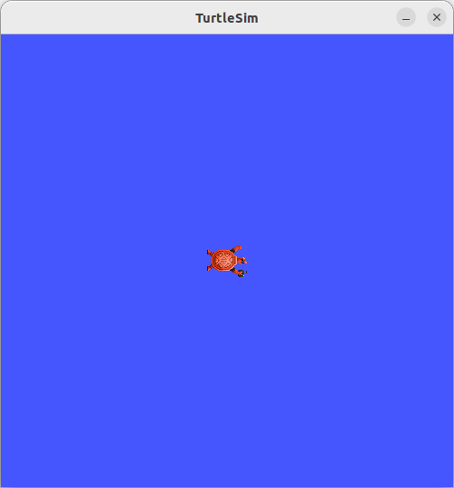
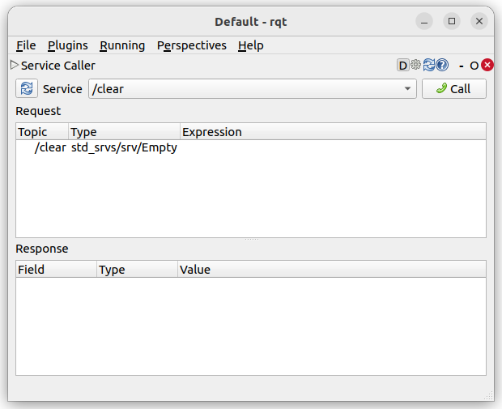
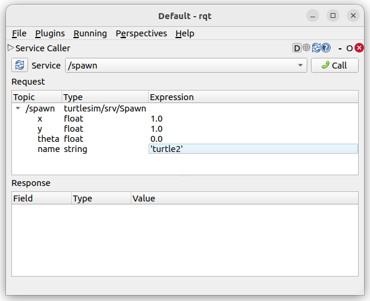
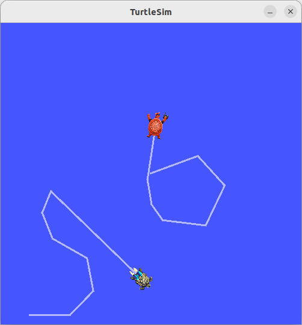

# 工作空间与包管理
:label:`sec_workspace`

## 创建一个工作空间

工作空间是一个具有特定结构的目录。通常包含一个src子目录，该子目录是ROS 2包的源代码所在的位置。通常情况下，该子目录开始时为空。

首先，创建一个目录（ros2_ws）来包含我们的工作空间。打开一个终端窗口，运行：

```bash
mkdir -p ~/ros2_ws/src
cd ~/ros2_ws
```

此时，工作空间中包含一个空目录src。让我们使用colcon来构建这个空的工作空间。

```bash
colcon build
```

构建完成后，应该看到新生成了build、install和log这3个目录。所有在本工作区中的包，构建后都会在install目录中安装。

## 创建一个包

“包”（package）是组织代码和资源的基本单元。一个包可以包含一个或多个节点，以及这些节点所需的配置文件、库、数据集等资源。

如前所述，包应放在工作区的src子目录内。所以让我们导航到src目录，并在该目录内创建一个新的包。可以使用命令ros2 package create，后跟用于创建包所需的构建工具参数，来生成一个空的包。

```bash
# 创建一个Python包
ros2 pkg create --build-type ament_python pkg_py_example
# 创建一个C++包
ros2 pkg create --build-type ament_cmake pkg_cpp_example
```

此时，在src目录中生成了两个子目录：pkg_py_example和pkg_cpp_example。返回到工作空间，再次进行构建。

```bash
cd ..
colcon build
```

现在这个命令将重新构建整个工作区，包括我们刚刚创建的两个新包。在调用这两个包之前，需要先激活当前工作区，即让ROS 2将当前工作区识别为叠加层（overlays）。这样，我们已经添加的以及将要在这个工作区中添加的所有包都将被识别为ROS 2包。之后，我们就能够使用ros2命令执行其中的内容。

为此，我们需要source一个位于install文件夹中的特定文件：

```bash
source install/setup.bash
```

注意，执行source后，只有在当前终端的上下文环境中当前工作区被加载。新打开的终端，需要从新source才行。

为了验证工作区是否加载成功，以及ROS 2是否识别到了我们刚刚创建的两个新包，可以使用命令：

```bash
ros2 package list
```

该命令列出了所有当前可用的包。可以看到两个新包出现在输出列表中。如果我们打开一个新的终端，列出所有当前可用的包，可以发现两个新包并没有出现在输出列表中。

记住，无论何时打开一个新的终端，在使用工作区中的包之前，必须先source工作区。

## ROS图和ROS节点

ROS图（Graph）是指所有正在运行的节点以及它们之间的通信关系的集合，是所有组件同时处理数据的网络。这个图包括了节点之间的所有连接，如：话题（Topics）、服务（Services）、动作（Actions）和参数服务器（Parameter Server）的交互。ROS图是动态的，它可以随着节点的启动和关闭而变化，也可以随着节点之间建立或断开连接而变化。

节点（Node）是ROS图中的基本执行单元，它是运行在操作系统上的一个进程，可以发布或订阅话题、提供或请求服务、执行动作等。节点通过ROS的通信机制与其他节点进行交互，这些交互关系定义了节点在ROS图中的连接。节点之间的连接是通过分布式发现过程建立的。

节点的发现是通过ROS 2的底层中间件自动进行的，可以概括如下：当一个节点启动时，它会向网络上具有相同ROS域（通过ROS_DOMAIN_ID环境变量设置）的其他节点宣布其存在。节点对此公告做出响应，并提供有关自己的信息，以便建立适当的连接并使节点能够通信；节点定期宣布它们的存在，以便即使在最初的发现期之后，也能与新发现的实体建立连接；当节点下线时，它们会向其他节点宣布。

只有当其他节点具有兼容的QoS服务设置时，节点才会与之建立连接。

一个完整的机器人系统由许多协同工作的节点组成。在ROS 2中，单个可执行文件（C++程序、Python程序等）可以包含一个或多个节点。

命令``ros2 run <package_name> <executable_name>``用于从包中启动一个可执行文件，例如：

```bash
ros2 run turtlesim turtlesim_node
```

这里，包的名称是turtlesim，可执行文件的名称是turtlesim_node。然而，我们仍然不知道节点名称。

可以使用``ros2 node list``命令查看节点名称。该命令将显示所有正在运行的节点的名称。当您想要与一个节点交互时，或者当您的系统运行许多节点并需要跟踪它们时，这尤其有用。

当turtlesim仍在运行时，打开一个新终端，并输入以下命令：

```bash
ros2 node list
```

终端将返回节点名称：

```
/turtlesim
```

在运行可执行文件时，重映射允许您将默认节点的属性（如节点名称、主题名称、服务名称等）重新分配给自定义值。例如，要重新分配``/turtlesim``节点的名称，可以在新终端中运行以下命令：

```bash
ros2 run turtlesim turtlesim_node --ros-args --remap __node:=my_turtle
```

此时返回到运行``ros2 node list``的终端，并再次运行它，您将看到两个节点名称：

```
/my_turtle
/turtlesim
```

当知道各节点的名称后，可以通过命令行``ros2 node info <node_name>``访问节点的更多信息，例如：

```bash
ros2 node info /my_turtle
```

该命令返回此节点的订阅者、发布者、服务和操作的列表，即与此节点交互的ROS图连接。

## 探索ROS 2的常用工具

Turtlesim是一个用于学习ROS 2的轻量级模拟器，它展示了ROS 2的基本功能。ros2命令行工具是用户用来管理、内省和与ROS系统交互的。它支持针对系统及其操作的不同方面的多个命令。可以使用它来启动节点、设置参数、监听topic等等。ros2工具是ROS 2发行版的核心部分之一。rqt是ROS 2的图形用户界面（GUI）工具。rqt中所做的一切都可以在命令行上完成，但rqt提供了一种更用户友好的方式来操作ROS 2元素。

检查软件包是否已安装：

```bash
ros2 pkg executables turtlesim
```

上面的命令应该返回一个turtlesim的可执行文件列表：

```
turtlesim draw_square
turtlesim mimic
turtlesim turtle_teleop_key
turtlesim turtlesim_node
```

否则，请安装turtlesim软件包：

```bash
sudo apt install ros-humble-turtlesim
```

要启动turtlesim，请在终端中输入以下命令：

```bash
ros2 run turtlesim turtlesim_node
```

模拟器窗口应该出现，中间有一只随机生成的乌龟，如 :numref:`fig_turtlesim_start` 所示。


:label:`fig_turtlesim_start`

在终端中，在该命令下，可以看到来自节点的日志信息：

```
[INFO] [turtlesim]: Starting turtlesim with node name /turtlesim
[INFO] [turtlesim]: Spawning turtle [turtle1] at x=[5.544445], y=[5.544445], theta=[0.000000]
```

通过日志信息可以看到默认的乌龟名字和它出生的坐标。

打开一个新的终端，运行一个新的节点来控制第一个节点中的乌龟：

```bash
ros2 run turtlesim turtle_teleop_key
```

激活运行turtle_teleop_key的终端的焦点，这样就能控制turtlesim中的乌龟。使用键盘上的箭头键来控制乌龟，它将在屏幕上移动，并使用其附带的“笔”绘制迄今为止所走过的路线。

每次按动箭头键，只会使乌龟移动一小段距离，然后停止。这是因为，实际上，如果操作员失去了与机器人的连接，他不希望机器人一直继续执行指令。此时可以使用ros2命令行工具中的相应命令来查看节点及其关联的话题、服务和动作：

```bash
ros2 node list
ros2 topic list
ros2 service list
ros2 action list
```

打开一个新的终端来安装rqt及其插件：

```bash
sudo apt install ros-humble-rqt*
```

运行rqt：

```bash
rqt
```

第一次运行rqt时，窗口将为空白。不用担心，只需从顶部的菜单栏中选择``Plugins > Services > Service Caller``，加载服务调用插件，如 :numref:`fig_rqt_service_caller` 所示。


:label:`fig_rqt_service_caller`

点击Service下拉列表左侧的刷新按钮，确保turtlesim节点的所有服务都可用。单击Service下拉列表查看turtlesim的服务，然后选择``/spawn``服务。这里将使用rqt来调用``/spawn``服务。你可以从它的名字猜到``/spawn``将在turtlesim窗口中创建另一只乌龟。

双击Expression列中的空单引号处，为新乌龟取一个唯一的名称，如：turtle2。您可以看到，这个表达式对应于name的值，并且是字符串类型的。接下来输入一些有效的坐标来产生新的海龟，比如x=1.0和y=1.0，具体如 :numref:`fig_rqt_spawn_turtle` 所示：


:label:`fig_rqt_spawn_turtle`

要生成turtle2，需要通过单击rqt窗口右上角的Call按钮来调用该服务。如果服务调用成功，则应该看到一只新乌龟（同样是随机设计的）在之前输入的x和y坐标处产生。此时刷新rqt中的服务列表，则还应该看到现在有与新乌龟相关的服务（``/turtle2/…``）。

此时还没有办法移动turtle2，那是因为对于turtle2来说没有对应的遥操作节点。但是，如果直接尝试运行与前面相同的命令，该命令还会控制turtle1，而不是turtle2。改变这种行为的方法是重新映射cmd_vel话题。

在ROS 2中，每个节点都有一个唯一的名称，用于在系统中标识它。节点之间通过话题、服务和动作进行通信，这些通信渠道也有自己的名称。节点重映射（node remapping）允许用户在运行时更改节点名称和话题/服务/动作的名称。这种机制为用户提供了一种灵活性，可以在不修改代码的情况下调整系统中的节点和通信路径。

在一个新的终端中运行：

```bash
ros2 run turtlesim turtle_teleop_key --ros-args --remap turtle1/cmd_vel:=turtle2/cmd_vel
```

现在，可以在这个终端处于活动状态时移动turtle2，在另一个运行turtle_teleop_key的终端处于活动状态时移动turtle1，如 :numref:`fig_turtlesim_remap` 所示。


:label:`fig_turtlesim_remap`

要停止模拟，可以在turtlesim_node终端中输入``Ctrl+C``，在turtle_teleop_key终端中输入``q``。

## 同时运行多个节点

使用``ros2 run``，需要为运行的每个新节点打开新的终端。当创建越来越多节点，同时运行更复杂的系统时，打开终端和重新输入配置细节会变得乏味。通过launch文件可以同时启动和配置包含不同ROS 2节点的多个可执行文件。使用``ros2 launch``命令运行一个launch文件将同时启动整个系统————所有节点及其配置。

打开一个新终端并运行：

```bash
ros2 launch turtlesim multisim.launch.py
```

此命令将运行以下启动文件：

```python
# turtlesim/launch/multisim.launch.py
 
from launch import LaunchDescription
import launch_ros.actions
 
def generate_launch_description():
    return LaunchDescription([
        launch_ros.actions.Node(
            namespace= "turtlesim1", package='turtlesim', executable='turtlesim_node', output='screen'),
        launch_ros.actions.Node(
            namespace= "turtlesim2", package='turtlesim', executable='turtlesim_node', output='screen'),
    ])
```

上面的启动文件是用Python编写的，但也可以使用XML和YAML来创建启动文件。该启动文件同时启动了两个turtlesim节点。
