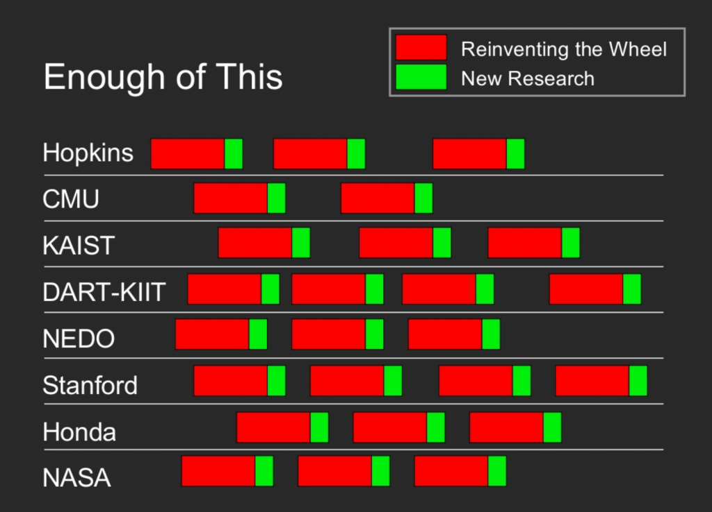

## L1 ros: an open source robot operating system

本章我们将介绍以下内容：

ros的发展历史，pr2示例demo

### 1. ros 的发展历史

#### 1.1 斯坦福时期：

为机器人编写软件是困难的，特别是随着机器人技术的规模和范围不断扩大。不同类型的机器人可能具有迥异的硬件，使得代码重用变得非常困难。除此之外，所需代码的规模之大也令人望而生畏，因为它必须包含从驱动级软件开始，一直延伸到感知、抽象推理等深度堆栈。由于所需专业知识的广度远远超出任何单个研究人员的能力范围，因此机器人软件架构必须支持大规模的软件集成工作。

ROS 最初由 Keenan Wyrobek 和 Eric Berger 在斯坦福大学期间发起，旨在解决机器人技术中常见的**重新发明轮子**问题。这两位创始人关注的主要问题包括：

1. 机器人技术中过多的时间被用于重新实现构建复杂机器人算法所需的软件基础设施，包括传感器和执行器的驱动程序，以及机器人内部不同程序之间的通信。
2. 由于时间花费在基础设施上，用于实际构建基于该基础设施的智能机器人程序的时间相对较少。

即使在同一组织内部，每个新项目也需要重新实施驱动程序和通信系统，这加剧了重新发明轮子的问题。Keenan 和 Eric 在向投资者推销时通过一张幻灯片完美地阐述了这种情况。

为了解决这一问题，Eric 和 Keenan 于 2006 年在斯坦福大学创建了一个名为“斯坦福个人机器人计划”的项目。该项目的目标是构建一个允许进程相互通信的框架，并提供一些工具，以帮助在此框架上创建代码。所有这些框架都应该用于为即将构建的机器人（个人机器人）创建代码，同时也作为其他人的测试平台和示例。他们计划制造 10 个这样的机器人，并将其提供给大学，以便他们可以基于该框架开发软件。

这一想法在当时并不新鲜。实际上，在当时，机器人社区已经很多类似的框架。其中，Player/Stage 是在开源领域最著名的项目之一，而在专有系统领域则有 URBI。甚至索尼为Aibo 机器人开发的 Open-R 系统，也是为了解决这个问题而创建的。ros通过开源的方式，建立了庞大的用户社区，使他们从一系列通用框架中脱颖而出，成为机器人开发的通用解决方案。

他们通过“机器人界的linux”这一概念，筹集到了5美金的资金。基于此，他们构建了Personal Robot PR-1作为硬件原型，并开始利用它开发软件，软件开发过程中他们借鉴了斯坦福大学Morgan Quigley的switchyard 系统。区别于主流机器人①仿人机器人研究平台humanoid robot research platforms，②机械臂和夹具试验台robot arm-and-gripper test beds两种设计理念，Keenan他们使用轮子代替机械腿，并构建机械臂，使其可以在人类工作环境完成相应任务。然而，他们意识到，为了构建一个真正通用的系统并向研究小组提供这些机器人，他们需要额外的资金。

2008 年左右的某个时候，Keenan和Eric 会见了Scott Hassan，他是Willow Garage的投资者和创始人，该研究中心专注于机器人产品。Scott 发现他们的想法非常有趣，并资助了他们400万美金，在 Willow Garage 内启动个人机器人项目。ros: robot operating system诞生了，PR2 机器人也随之诞生。

ROS不是传统意义上的流程管理和调度的操作系统；相反，它在异构计算集群的主机操作系统之上提供了一个结构化的通信层。ros具有**peer-to-peer**，**tools-based**，**multi-lingual**，**thin**，**free and open-source**这五项特点，为了支持跨语言开发，ROS使用一种简单的、与语言无关的接口定义语言interface definition language（IDL）来描述模块之间发送的消息。

#### 1.2 willow garage时期 & open robotics时期

**2010年 ros 1.0 发布**：第一个官方 ROS 发行版：ROS Box Turtle 于 2010 年 3 月 2 日发布，标志着 ROS 首次以一组版本化的软件包正式发布供公众使用。这些发展催生了第一架运行 ROS 的无人机，第一辆运行 ROS 的自动驾驶汽车，以及乐高Mindstorms的 ROS 改编。

**2011年TurtleBot 发布**：PR2机器人虽然好，但是成本居高不下，几百万的价格让绝大部分开发者望而却步，官方也注意到了这个问题。所以，官方在2011年发布了TurtleBot，这款机器人采用了扫地机器人的底盘，加上xbox的体感传感器Kinect，直接使用笔记本电脑就可以控制，支持ROS的所有开源功能。它的价格十分便宜，大大推动了ROS机器人的应用。

**2012年 ROScon**:随着ROS的使用人数越来越多，第一届ROS开发者大会ROScon在明尼苏达州圣保罗举行。全世界的开发者会齐聚一堂，分享自己的开发心得，其中不乏微软、亚马逊等大公司的身影。

**2013年 OSRF接管ROS**：willow garage公司解散，OSRF 成为 ROS 的主要软件维护者。

**2014年 ROS Indigo发布**：经过快速迭代后，ROS版本逐渐走向稳定，ROS官方根据Ubuntu的脚步，每两年发布一个长期稳定支持版，支持时间为5年。

**2017年 ROS2 Ardent Apalone发布**：随着ROS的普及，应用ROS的机器人类型已经和PR2机器人有了天翻地覆的问题，也并不具备PR2这样的条件，那原本针对PR2设计的软件框架，就会出现计算资源有限、通信干扰、以及产品化等问题。类似的问题不断涌现，致使更加适合各种机器人应用的ROS2诞生了。

**2020 ROS noetic**：第二个ROS长期支持版本发布。

**2022 ROS2 Humble**：第一个ROS2长期支持版本发布。

### 2. pr2 demo