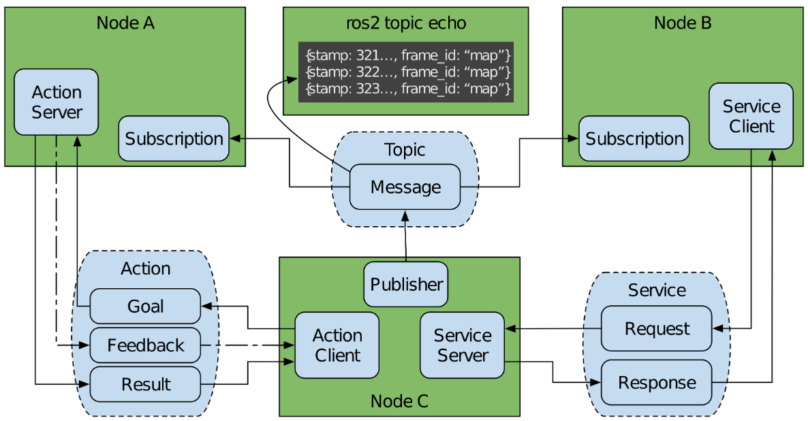

# 引言
:label:`chap_introduction`

在机器人开发的历史中，人们提出了多种中间件解决方案，引入了模块化和可适应的特性，以便使构建机器人系统变得更容易。随着时间的推移，一些中间件已经发展成为包含实用程序、算法和示例应用程序的丰富生态系统。很少有中间件在成熟机器人产业中的重要性能够与ROS 1相媲美。

ROS 1在几乎每个智能机器人领域都产生了影响。其商业崛起源于其提供的自主导航、仿真、可视化、控制等旗舰项目。随着商业机会转化为产品，ROS 作为研究平台的根基开始显示出其局限性。安全性、在非传统环境中的可靠性以及对大型嵌入式系统的支持成为推动行业前进的关键。许多公司正在ROS 1之上构建变通的解决方案，以创建更可靠的应用程序。

ROS 2，作为机器人操作系统的第二代产品，是彻底重新设计的，旨在解决原有挑战，并进一步发展其依赖社区力量的特性。ROS 2建立在数据分发服务（Data Distribution Service，DDS）之上，DDS是一种开放通信标准，广泛应用于军事、航天和金融等关键领域。它有效解决了构建可靠机器人系统时所面临的一系列问题。得益于DDS，ROS 2拥有了行业领先的安全性能、嵌入式和实时支持能力、多机器人通信功能，以及在不理想网络环境中的运行能力。在选择DDS之前，社区考虑了其他通信技术，如：ZeroMQ和RabbitMQ，最终选择了DDS，因为它具备包括UDP传输、分布式发现和内置安全标准等一系列全面的功能。

## ROS 2

ROS 2是一个用于开发机器人应用程序的软件平台，也被称为机器人软件开发套件（SDK）。重要的是，ROS 2是开源的。ROS 2在Apache 2.0许可证下分发，该许可证授予用户广泛的修改、应用和重新分发软件的权利，没有回馈义务。ROS 2依赖于开源生态系统，鼓励贡献者创建和发布他们自己的软件。大多数附加软件包也使用Apache 2.0许可证或类似的许可证。开源代码对于推动ROS 2的广泛采用至关重要，因为它允许用户自由地使用和分发他们的应用程序，不受任何限制。

### 范围

ROS 2 支持从教育、研究到产品开发和部署等多领域的机器人应用。这一框架包括众多相互依赖的软件组件，这些组件常用于开发机器人程序。整个软件环境可分为三大类：

  * 中间件：被称为“管道”，ROS 2的中间件负责处理组件间的通信，包括网络API和消息解析器等。
  * 算法：ROS 2提供了许多在构建机器人应用时常用的算法，例如：感知、SLAM、规划等。
  * 开发工具：ROS 2提供了一系列命令行和图形界面工具，包括用于配置、启动、内省、可视化、调试、仿真和日志记录的工具。同时，还有大量工具支持源代码管理、构建和分发。

中间件作为ROS2的基础，下面展开介绍。

### 设计

**1、设计理念**

ROS 2的设计遵循一系列原则和具体要求。以下是一些确立的设计原则：

  * 分布：在处理机器人技术这类复杂领域的问题时，最适合采用分布式系统的方法。需求被划分为多个功能独立的组件，如硬件的设备驱动程序、感知系统、控制系统等。运行时，这些组件各自拥有执行环境，并通过明确的通信方式共享数据。这种组件的组合应当以安全和去中心化的方式进行。
  * 抽象：为了有效管理通信，需要建立接口规范。这些规范明确了数据交换的语义。良好的抽象设计能在展示组件细节的好处与过度适配应用程序其他部分到该组件的成本之间找到平衡，避免因过度依赖而难以替换其他方案。这种方法促进了一个生态系统的形成，其中的组件可互操作，且独立于特定的硬件或软件供应商。
  * 异步：通过异步传递定义的消息，创建了一个基于事件的系统。采用这种方法，应用程序能够在多个时间域中运行，这些时间域是由物理设备与众多软件组件相结合产生的；每个组件可能都有自己的频率来提供数据、接受命令或发出事件信号。
  * 模块：UNIX的设计理念“每个程序专注于做好一件事”在这里得到了体现。模块化原则贯穿于各个层面，包括：库API、消息定义、命令行工具，以及整个软件生态系统。这个生态系统由众多独立而又相互协作的软件包组成，而不是单一的代码库。

我们不认为这些设计原则是普遍适用且无需权衡的。异步性有时也会让实现确定性的执行变得更加复杂。对于任何一个单独且明确界定的问题，理论上可以构建一个专用的、单一的整体解决方案，这种方案由于不涉及任何抽象概念或分布式通信，因此在计算效率上可能更高。

然而，基于十年的ROS 1项目经验，我们坚信坚持这些原则通常能带来更优的成果。这种方法有助于代码重用、软件测试、故障隔离，以及跨学科项目团队之间的合作，同时也促进了全球范围内的协作。

**2、设计要求**

ROS 2旨在满足基于机器人开发者的设计原则和需求而确定的一系列要求。

  * 安全：任何与网络交互的软件都必须具备保护这种交互不受意外或恶意使用的安全功能。ROS 2的内置安全系统涵盖了认证、数据加密和访问控制等方面。通过设定访问控制策略，设计者可以自定义谁有权就哪些内容进行通信，以满足特定的安全需求。
  * 嵌入式系统：通常情况下，机器人由传感器、执行器以及其他外围设备组成。这些设备可能较为复杂，包含需要与运行ROS 2的CPU（或CPUs）进行通信的微控制器。虽然小型嵌入式设备上并不需要运行完整的ROS 2系统，但ROS 2应当能够促进并统一CPU与微控制器的集成过程。Micro-ROS使得ROS 2能够在嵌入式系统中得以应用。
  * 多样化网络：机器人被广泛应用于各种网络环境，包括用于工业机械臂的有线局域网，以及为行星漫游车提供的多跳卫星连接。此外，机器人还常常利用内部网络，连接同一CPU内部以及跨CPU的进程。ROS 2提供服务质量（Quality of Service）配置，控制数据如何通过系统流动，从而适应网络的限制。
  * 实时计算：从人形机器人到自动驾驶汽车，机器人应用通常要求进行实时计算。为了达到安全标准或性能目标，系统的某些部分需要在可预测且一致的时间内完成执行。ROS 2提供了API，让开发实时系统的工程师能够根据具体的应用需求设定和执行相应的约束。
  * 产品就绪：当机器人从实验室应用到商业领域时，会面临更多新的限制和挑战。ROS 2的目标是满足产品设计、开发和项目管理的各种要求。这些努力的一个直接成果是，Apex.AI公司基于ROS 2开发的自动驾驶软件获得了功能安全（ISO 26262）认证。这意味着ROS 2现在可以被应用于像自动驾驶汽车和重型机械这样的安全关键系统中。

### 通信模式

ROS 2 API提供了访问多种通信机制。这些机制主要包括话题（Topics）、服务（Services）和动作（Actions），它们均以节点（Node）的概念为核心进行组织。此外，ROS 2还提供了参数（Parameters）、定时器（Timers）、启动（Launch）以及其他辅助功能API，这些工具可用于设计机器人系统。

  * 话题：用户最常使用的通信模式是话题，这是一种实现异步消息传递框架。它与其它异步框架（如 ASIO）相似。ROS 2提供了发布-订阅功能，但特别强调使用异步消息传递来组织系统，并采用强类型接口。这通过在计算图中以节点的形式组织终点来实现。节点作为一个关键的组织单元，使用户能够理解和推理复杂的系统结构，如 :numref:`fig_node_interfaces` 所示。匿名发布-订阅架构支持多方之间的通信，这对于监控系统内部活动非常有利。开发者可以通过简单地订阅某个话题，而无需对系统做任何修改，就能观察到该话题上传递的所有消息。
  * 服务：异步通信并非总是最佳选择。ROS 2还提供了一种基于请求-响应的通信模式，即“服务”。这种通信方式便于在请求和响应之间建立数据关联，有助于确认任务已完成或已接收，如 :numref:`fig_node_interfaces` 所示。特别的是，ROS 2实现了服务客户端在调用过程中的非阻塞特性。此外，服务按照节点进行组织，便于进行自我检查或系统分析，使子系统的接口能在系统诊断中集中展示。
  * 动作：ROS 2的一种独特通信模式是“动作”。这种模式以实现特定目标为核心，采用异步通信方式，包括发起请求、接收响应、周期性反馈以及具备可取消操作的功能，如 :numref:`fig_node_interfaces` 所示。动作模式适用于长时间执行的任务，例如自主导航或机械操作，同时也适用于多种其他场景。与“服务”类似，动作允许非阻塞操作，并且被安排在节点架构之下进行管理。

:label:`fig_node_interfaces`

### 中间件架构

遵循之前的设计哲学，ROS 2的架构由多个关键的抽象层构成，这些抽象层分布在众多相互独立的软件包中。这些抽象层使得对于特定功能，如中间件或记录器，可以有多种实现方案。此外，这种分散在多个软件包的设计允许用户替换某些组件，或仅选择他们需要的系统部件，这对于系统的认证过程可能尤为重要。

**1、抽象层**

:numref:`fig_client_library_stack` 展示了ROS 2中的抽象层次。在开发过程中，这些层次通常被客户端库封装，开发者只有在遇到特殊的应用程序需求时才需要深入了解。大多数用户仅需使用客户端库即可。

客户端库允许访问核心通信API，这些库针对不同编程语言进行了优化，以符合各自的语言特性和功能。通信机制不依赖于系统如何在计算资源中分布————无论是在同一进程、不同进程，还是不同计算机中。用户可以将应用程序部署在多台机器和进程上，甚至利用云计算资源，而无需对源代码进行大量修改。ROS 2能够通过互联网连接到云资源。目前有一些产品可以帮助将ROS 2集成到云平台，例如AWS IoT RoboRunner和相关的RoboMaker产品。不过，建议使用更专业的、为特定目的构建的技术。

客户端库依赖于一个中间层接口——rcl，它为每个客户端库提供通用功能。这个用C语言编写的库被所有客户端库所使用，尽管并非强制要求。在rcl之下，有一个名为rmw（ROS Middleware，ROS中间件）的中间件抽象层，它提供了必要的通信接口。各个中间件的供应商实现了rmw接口，使得这些中间件可以在不更改代码的情况下相互替换。

用户可以根据不同的需求，如性能、软件许可或支持的平台，选择不同的rmw实现，从而使用不同的中间件技术。虽然ROS 2支持的rmw大多数基于DDS，但也有部分社区支持的rmw适用于其他通信方式。这种抽象层的存在，为ROS 2提供了随时间演进的灵活性，同时对基于ROS 2构建的系统造成的影响非常小。

网络接口（如话题、服务、动作）是通过接口描述语言（IDL）和消息类型来定义的。在 ROS 2中，这些类型通过ros idl格式（.msg文件）或OMG IDL标准（.idl 文件）来明确。用户提供的接口定义会在编译阶段自动生成，这样就会创建出适配各种客户端库语言的通信代码。

**2、架构的节点模式**

除了帮助开发者构建程序的常规架构模式外，ROS 2还特别提供了一个管理节点生命周期的模式。这个模式通过一个状态机实现节点的状态转换，包括未配置（Unconfigured）、非活动（Inactive）、活动（Active）和最终化（Finalized）等状态。这些状态使得系统集成者能够精确控制系统中各个节点的激活时机。这对于协调分布式异步系统的不同部分至关重要。

如上所述，通信对机器和进程中端点的具体位置不敏感。编写节点时不应决定其在哪个机器或进程中，而应根据其在整个系统中的应用来决定。将节点编写为组件后，可以将其作为配置分配给任意进程。这对于开发中的系统是一个重要特性，允许开发人员根据不同情况调整节点的运行位置。例如，为了节省系统资源或降低延迟，可能会将多个节点配置为共享同一进程。

:label:`fig_client_library_stack`

### 软件质量

为了在关键应用领域采用ROS 2，其设计和实现必须达到高质量标准。监管和认证机构需要了解系统的当前状态及其形成过程。因此，我们持续执行一个三部分的策略来评估和公开软件质量。

  * 设计文档：在计划进行重大更新之前，必须制定一份书面的理由和工作设计方案。这些文档通常以设计文档（http://design.ros2.org/）或ROS增强提案（REP，https://www.ros.org/reps/）的形式出现。
  * 测试：ROS 2中的每个功能都需要进行测试，以确保其正确运行。这些测试会在持续集成过程中定期执行。同时部署了单元测试和集成测试，以及一系列静态分析工具。
  * 质量声明：并非ROS 2中的每个软件包都需要经过严格的文档化和测试。因此，制定了一个分级质量政策。该政策明确了不同质量级别在开发实践、测试覆盖、安全性等方面的要求。

### 性能和可靠性

网络通信对于机器人框架至关重要。在稳定的网络环境中，TCP/IP 是标准的解决方案，因为它在多数操作系统上得到了优化。然而，在无线通信中，TCP/IP 难以有效传输数据，因为信号中断可能导致数据包的退回、重传和延迟。ROS 1采用TCP/IP作为其基础，因此在无线通信环境下表现不佳。

在类似的无线通信环境中，ROS 2并未遇到类似问题。DDS通过使用UDP传输数据，不进行数据的自动重传。在不可靠的网络条件下，DDS自行决定重新传输的时机和方法。DDS引入了“服务质量”（QoS）机制，通过这一机制可以调整设置，以优化可用带宽和延迟。

可靠性设置决定了消息传递是否确保成功。在“尽力而为”模式下，发布者仅尝试传递一次消息，这在数据频繁更新且旧数据迅速过时的情况下很有用，例如传感器数据。而设置为“可靠”模式时，发布者会持续发送数据，直到接收方确认接收。

持久性QoS设置决定了消息的保留方式。“Volatile” 类型的消息在发送后不会被保留。而 “transient-local” 类型的消息则会在需要时存储，并在新订阅者加入时发送给他们。

连接的历史记录配置决定了在网络无法跟上数据传输速率时的行为。若设置为“keel-all”，则所有数据将被保留，直到应用程序处理完毕。大多数应用程序采用“keep-last”策略，它维护一个固定大小的数据队列，并在必要时覆盖最旧的数据。其他设置，如截止期限（deadline）、寿命（lifespan）、活跃度（liveliness）和租期（lease duration），对于设计实时系统也非常重要。

### 安全性

安全性对于现代商业机器人软件开发工具包至关重要。ROS 2采用了DDS-Security标准，并额外提供了一套工具SROS2，以方便管理安全基础设施。DDS-Security主要包含三个核心概念：

  * 身份认证：在网络中确认消息或参与者的身份。ROS 2通过使用数字签名进行身份验证，这种方式被称为公钥加密。SROS2提供了命令行工具，用于生成和存储这些数字签名。
  * 访问控制：实现对已认证网络参与者细粒度的策略控制。这允许参与者仅与经过批准的其他参与者建立连接，并通过预授权的网络接口进行通信。SROS2提供了命令行工具，用于创建这些策略配置。
  * 加密：这一机制确保了第三方无法监听或向网络中插入伪造数据。加密过程采用AES-GCM对称加密技术。密钥材料是从认证过程中获得的共享密钥派生出来的。

## 案例研究

以下5项研究突出了ROS 2对各个组织带来的显著加速作用。每个案例研究主要基于访谈、客户反馈以及研究过程中分析的代码库，对ROS 2对每个组织的影响进行了定性评估。案例的多样性和涉及的范围证明了ROS 2在整个机器人行业中的重要性。

### 陆地：Ghost Robotics

Ghost Robotics是一家位于费城的公司，专注于为国防、企业和研究领域研发四足机器人。他们制造的机器人设计用于非结构化的自然环境，这些环境无法由传统的轮式或履带式机器人穿越。Ghost的Vision-60机器人被部署在洞穴、矿井、森林和沙漠中，甚至可以在数英寸深的水或雪中行走。这些机器人被宾夕法尼亚大学的团队用于DARPA地下挑战赛，并且Ghost与美国军方保持着活跃的合作关系，用于基地安全和其他实验性应用。

ROS 2被用于他们主要的计算平台————Nvidia Jetson Xavier，该平台负责任务执行、高级步态规划、地形映射和定位。Ghost的软件中有大约90%使用ROS 2进行通信和组织，而其余部分预计在不久的将来也采用ROS 2。

**1、软件架构**

ROS 2 在促进他们内部的协作和软件设计方面起到了巨大的作用。无论是他们的核心系统还是任务控制软件，都与ROS 2紧密集成。他们利用主子系统之间的发布-订阅接口，使得在不断改进各个技术的同时，能够保持API的一致性。这种项目之间的清晰划分使得他们能够并行开发，而不会影响到其他团队的正常运作。

他们的任务控制软件利用ROS 2动作来请求、取消或获取有关当前任务的反馈。该软件需要一个任务标识符，以便与潜在任务的数据库进行交叉引用，以确定要执行的任务。然后，它会组装任务中的每个子任务，并激活执行特定任务所需的相应功能，这些功能被建模为生命周期节点。最后，软件执行整个任务。

Ghost的软件大多数是以生命周期和组件节点的模式实现的。生命周期节点根据当前任务需求动态地启用和禁用功能，例如在GPS定位和视觉惯性定位（VIO）之间切换。他们拥有数十个独特的功能，可以根据不同的任务随时使用，而这些功能在闲置时几乎不占用任何后台资源。组件节点是由多个团队独立开发的独立模块，在运行时将这些模块组合在一起。Ghost发现，在与大型跨学科团队合作，特别是在计算资源有限的环境下工作时，这些策略尤为重要。

ROS 2提供的工具让Ghost能够在短短几个月内创建一个高度灵活和高效的自主系统。相比之下，如果从零开始，即使由多名工程师参与，该公司估计也需要多年时间才能开发出类似的功能。因此，这些工具不仅加快了开发进程，还帮助公司自由地支持新的定制用户应用程序。

**新冠疫情**

在疫情初期的封锁之后，尽管对关键硬件的接触减少，机器人软件团队在规模上扩大了一倍。同时，他们正在为几个月后向美国空军（USAF）进行的演示做准备。最终，该公司通过转向利用ROS 2中提供的功能，成功地调整了他们的流程，实现了目标。

在疫情爆发之前，大多数开发工作都是在办公室里使用机器人进行的。当机器人访问突然中断时，Ghost不得不将开发转移到ROS 2的模拟器Gazebo上。一名工程师能够创建自定义的Gazebo插件和仿真文件，这些文件是用来代表四足机器人的。这个仿真模型被用来开发美国空军演示中所需的全套自主系统。即使在能够重新回到办公室之后，这项新能力仍然在使用中 - 它使得内部开发自定义行为并将其部署到客户机器人的过程变得更加快速。

**ROS 2作为平衡器**

ROS 2为Ghost Robotics提供了一个强大的竞争平衡器。它帮助他们与资金雄厚且根基深厚的竞争对手有效竞争。Ghost并没有从头开始构建一个端到端的自有软件组合，而是尽可能地利用ROS 2的功能。截至2021年8月，Ghost Robotics仅有23名员工，与竞争对手相比，ROS 2已经为他们平衡了竞争赛场。Ghost能够在仅仅30个工程师年（大约7.5名工程师在4年内）后，将他们的Vision-60机器人推向客户进行部署使用。

### 海洋：Mission Robotics

Mission Robotics是一家位于旧金山湾区的公司，专注于开发海洋机器人。他们的设计以灵活性为核心，能够满足各种客户的需求，每个客户都可以根据自身应用对平台进行定制。Mission Robotics的机器人应用范围广泛，包括结构检查、环境调查、打捞作业和安全防护等任务。这些工作传统上依赖于专业潜水员完成，但他们的时间既有限又宝贵。通过引入机器人，重要的水下作业可以更频繁、更长时间地进行，且大大降低了人员的风险。

Mission Robotics开发的机器人配备了传感器，用于收集水面和水下环境的数据。这些机器人的传感器配置会根据用户的不同而有所差异，甚至在同一用户的不同潜水任务中也会有所变化。用户需要能够在特定的潜水任务中添加或移除组件，并确保能够可靠地访问由此产生的数据。Mission Robotics使用ROS 2作为这些数据流的通用数据总线，以方便客户轻松集成新的硬件。

**客户架构**

Mission Robotics的核心机器人软件并不依赖于ROS 2。拥有DDS使用经验的工程团队直接在Cyclone和Connext DDS上构建了他们的内部系统。这个内部软件完全由Mission Robotics团队中的一小部分成员负责维护。

海洋任务的需求通常特定于客户，不容易泛化，导致购买后需要定制。行业中的常见做法是根据需要附加额外的传感器或工具，但需要通过各种设备特定的接口独立操作和访问每个额外的外围设备。

相反，Mission Robotics使用ROS 2作为通用接口。当需要集成新的传感器（如特殊的低光相机）时，会开发一个设备驱动程序，它与传感器通信，并通过ROS 2发布其数据。驱动程序部署在Docker容器中，与本体的其他部分隔离。重要的是，Mission Robotics的客户可以使用ROS 2作为通用接口创建自己的扩展，使他们能够快速修改自己的机器人来定制应用，并共享通用基础设施。

**ROS 2作为加速器**

Mission认为ROS 2是他们整个行业的加速器，并指出，在海洋领域，缺乏标准化，且没有在现有技术基础上进行发展。这导致了人们不断地重复工作，例如在数据记录、传感器集成和消息格式等方面。这种重复劳动是资源的浪费，也导致了大量不兼容系统的出现。

Mission Robotics认为ROS 2正在改变海洋机器人行业，就像它对其他行业的影响一样。一套统一的消息、API和工具集将大大加快Mission及其他同行业公司的工作进度。特别是，使用rosbag进行数据记录为合作提供了可能。这种信息共享对于机器人工程师、操作员和海洋科学家（他们通常是数据的最终用户）来说非常有益。

### 天空：Auterion Systems

Auterion是一家总部位于瑞士苏黎世的无人机创业公司。该公司成立的宗旨是支持PX4开源飞控的开发者社区。利用其在PX4飞控系统方面的经验，Auterion开发了一款基于该项目的商业自动驾驶仪，并提供商业技术支持，帮助客户进行集成。Auterion的产品在行业内得到了广泛应用，能够支持多种飞行器。

在以往，无人机通常只能由经验丰富的飞手在开阔区域进行安全操作。Auterion致力于将无人机安全地应用于充满挑战的复杂环境，并提升其自动化操作能力。Auterion重视开放标准，因此选择了ROS 2来为其无人机系统整合更高级的功能，并与PX4自动驾驶仪协同工作。

**日志记录和反馈**

ROS 2提供的日志记录、系统检查和调试功能显著提高了Auterion在Skynode（他们的全集成自动驾驶系统）上的开发效率。利用ROS 2的日志记录功能，可以收集运行时的各种事件，例如错误信息、调试输出和系统元数据，这些数据被存储起来以供未来分析和调试使用。Auterion还使用rosbag2工具在运行时从系统的各个层面（从传感器数据到本体行为）收集原始数据流。这种全面的日志记录对于无人机来说尤为重要，因为像风力这样的环境因素对飞行条件有着显著影响，而这些条件往往难以在实验室内复现。因此，ROS 2的数据收集和日志记录功能在开发、调试和验证过程中扮演着核心角色。

Auterion还充分利用了强大的系统检查功能。他们使用rviz2这个三维渲染工具，在交互式环境中直观地展示无人机及其传感器数据。ROS 2中的三维可视化、数据收集和日志记录功能是Auterion选择使用ROS 2的关键因素之一。

**安全，自动化测试**

无人机飞行对地面人员、物品以及机身本身都存在潜在风险。由于每次实际飞行都可能面临坠毁的风险，因此安全地进行飞行测试需要大量的工作和时间投入。然而，在模拟环境中，测试飞行的成本和风险几乎可以忽略不计。模拟测试中的任何问题都可以迅速解决并多次迭代。Auterion利用ROS 2的模拟平台Gazebo，在硬件测试之前对软件进行全面测试，以确保其功能的安全性。

Gazebo也应用于他们的持续集成流程中，确保在各种本体类型和场景下不会出现性能退化。通过并行运行测试以快速获取结果，开发人员能够专注于解决特定问题，同时保持对软件安全性的信心。

Auterion还利用模拟测试在开发阶段验证复杂场景下的功能。例如，他们可以设定特定的飞行规则或场景，这对于验证他们的工作成果至关重要。在2021年，Auterion在Gazebo模拟环境中完成了大约22,000小时的飞行测试，包括那些用实际硬件测试不切实际的高风险场景。Auterion估计，这些模拟测试所提供的价值相当于取代了12名全职工程师的现场测试工作。考虑到他们的无人机成本从1,000美元到100,000美元不等，任何测试都存在显著风险，尤其是在需要测试的危险飞行条件下。通过在开发和验证阶段结合使用ROS 2的模拟测试，不仅降低了成本，还加快了开发进程。

### 太空：NASA VIPER

NASA的极地挥发物探索漫游车（VIPER）计划于2023年11月前往月球南极地区。在100天的任务期间，VIPER将利用多种仪器寻找水冰和其他资源。地球上的计算资源将用于创建地形图、进行地形测绘，并通过与深空网络的X波段连接计算三维图像，以协助漫游车的操作。许多地面操作工具、计算模块和高保真模拟都是基于ROS 2和Gazebo技术。

NASA的核心飞行系统负责提供硬件接口、基础错误检测和有效载荷服务。通过卫星链路向漫游车发送指令，并将漫游车的遥测数据传输回地球。这些遥测数据被发送至ROS 2网络，由多个节点处理。这些节点将图像数据转换成点云，计算视觉里程计和地形匹配，并将数据融合以进行姿态校正。这些数据随后输入到NASA的远程虚拟探索可视化环境（VERVE）中，使操作人员能够直观地看到漫游车周围的环境。操作人员利用这些信息模拟漫游车的移动，并最终控制漫游车进行实际移动。

**仿真器中的任务测试**

由于VIPER是一项太空飞行任务，其团队致力于开发高度可靠的软件。为此，他们大量使用Gazebo进行所有组件和系统的高仿真度测试。

VIPER团队选择使用Gazebo来辅助开发，因为在地球上精确模拟月球漫游车的运行是不现实的。他们强调，“月球的环境非常独特，包括光照和重力等因素，因此模拟测试至关重要，因为在地球上进行有效测试几乎是不可能的”。该项目利用定制的插件扩展了Gazebo的功能，创建了高度可定制的模拟环境，以支持包括太空在内的广泛机器人需求。

NASA开发了一些新插件，用于模拟任务特有的因素，如相机镜头光晕、月球光照条件、重力和月表地形等。NASA能够精确模拟车辆接口，甚至包括低级别的串行通信链路。这种模拟对于迭代和优化VIPER的系统设计选择极为重要。由于漫游车已经模拟到硬件级别，VIPER团队在发射前利用Gazebo对几乎所有的漫游车软件进行了测试和验证。

VIPER从Gazebo中复用了284,500行源代码，几乎未作修改，只有不到1%的修改是为了通过验证。NASA估计的模拟器开发速度为每月116行代码（总计2456个工作月以完成）。这种代码复用大大加快了开发进程，使他们能够在仅仅266个工作月内专注于VIPER的特定要素。

Gazebo和ROS 2的组合被用来训练漫游车的操作人员。ROS 2用于模拟漫游车的故障，使用VERVE，操作人员需要找出如何解决这些故障以使漫游车恢复运行。

**创造遗产**

NASA采用了多种通信机制，但近年来，许多项目因DDS能够适应可能存在高延迟、低带宽和低可靠性的卫星链路而选择了它。VIPER团队在评估了不同选项后，也选择DDS用于地球上的操作。

除了作为一种通信机制，VIPER团队还希望利用ROS 2的快速开发能力、内省和可视化工具，以及其开放的源代码资源。这些特性帮助新工程师更快地将他们的知识应用于飞行任务中，缩短了他们的学习曲线。

然而，在飞行任务中部署新软件需要经过彻底的验证和确认（V&V）流程。NASA倾向于使用先前任务中已经验证过的组件。利用经过验证的软件可以显著减少开发时间和成本。VIPER复用了来自Resource Prospector中的84%的588,000行代码，以及Gazebo和大约312个开源ROS 2软件包。尽管ROS 2在之前的任务中尚未使用，VIPER团队认为其提供的功能特性值得投入额外的努力通过验证流程。

一旦ROS 2在VIPER任务的地面操作中得到验证和使用，它在未来任务中扮演多种角色将变得更加容易，同时也促进了不同任务程序间机器人软件的重用。

### 大规模：OTTO Motors

OTTO Motors是位于安大略省的Clearpath Robotics的子公司，专注于销售用于陆地和海洋研究的平台。OTTO专注于开发用于仓库和工厂的物料搬运服务，通过部署自主机器人来大规模替代传统的人工控制设备。这些机器人已经在全球范围内部署了数千台，有的单个设施中就运营了超过100台。诸如丰田和通用电气等大公司已成为OTTO的客户。此案例研究为大规模机器人应用提供了独特见解。自部署在OTTO的机器人上以来，ROS 2操作系统已成功协调了超过200万小时的运行时间，并实现了150万公里的行驶里程。

**扩展多机器人技术**

OTTO Motors最初是在ROS 1操作系统上开发他们的技术。在使用ROS 1时，他们只能在同一个共享网络中测试不超过25个机器人，这是通过一个定制的多主机系统与他们的机队管理软件共同实现的。这种方法对于小规模机队来说已经足够，但随着OTTO扩展到更大的设施，这变成了一个发展瓶颈。

在对现有技术进行了详尽调查后，OTTO独立得出结论：DDS是最适合多机器人机队通信的技术。由于DDS所带来的更大的网络效应对他们有利，OTTO决定继续留在ROS生态系统内，并成为ROS 2的早期采用者之一。这一决策使他们能够利用ROS提供的强大功能，而无需单独开发一个专有的DDS框架。

在转移到ROS 2后，OTTO能够将客户设施中的机器人数量扩展到100多个。这种更大规模的多机器人部署得以实现，主要得益于ROS 2提供的细粒度和可扩展的网络拓扑管理能力，以及通过在共享网络链接上实施QoS来有效管理带宽。2017年的这些部署使其成为全世界最早期的ROS 2商业应用之一。ROS 2显著加快了OTTO的上市时间，使他们能够迅速将机器人数量扩展到前所未有的水平。OTTO Motors估计，通过采用ROS 2，他们在五年内节省了100万到500万美元的成本。此外，他们还通过不必将这些工具重写为专有框架，节省了几百个小时的工程开发时间。

**加速发展**

OTTO Motors在其开发和部署过程中，通过两种额外方式实现了加速。首先，它加快了公司内部功能开发的速度。得益于分布式架构和进程的隔离，一个庞大而分散的团队能够更高效地协作。通过使用定义清晰的ROS 2接口，OTTO能够将主要任务类别有效分离。他们的产品软件分布在众多由不同团队管理的存储库中，使用多种编程语言编写，并在运行时通过ROS 2实现集成。这种架构使得软件开发既灵活又高效。

其次，向客户提供ROS 2支持被证明是非常有价值的。OTTO和Clearpath将他们的平台出售给其他企业，供其构建定制化产品。例如，为了应对新冠大流行，一家公司购买了OTTO的平台，用于开发紫外线消毒机器人。得益于清晰定义和标准的API，外部合作者能够轻松地利用这些机器人平台，并将其集成到他们的自主系统中。这种能力不仅将关注点分离，还能将特定供应商的硬件，甚至整个机器人平台抽象化，从而使得公司能够快速构建新产品，确保公共安全。

## 小结

ROS 2经过彻底地重新设计，以应对现代机器人领域的挑战。它基于一系列精心考虑的原则、现代机器人需求以及广泛的定制支持而设计。以DDS为基础，ROS 2成为一个可靠且高质量的机器人框架，能够支持广泛的应用场景。这一框架正在帮助加速机器人从实验室走向实际应用，并推动机器人技术的下一次革命。

一系列案例已经证明ROS 2明显地加速了公司和机构在各种环境和不同规模下的实际部署。在众多行业中，ROS 2的标准化为新的合作机会、更快的开发速度以及新技术的推进创造了条件。随着ROS 2逐渐达到成熟，这一趋势在未来几年预计将持续发展。
